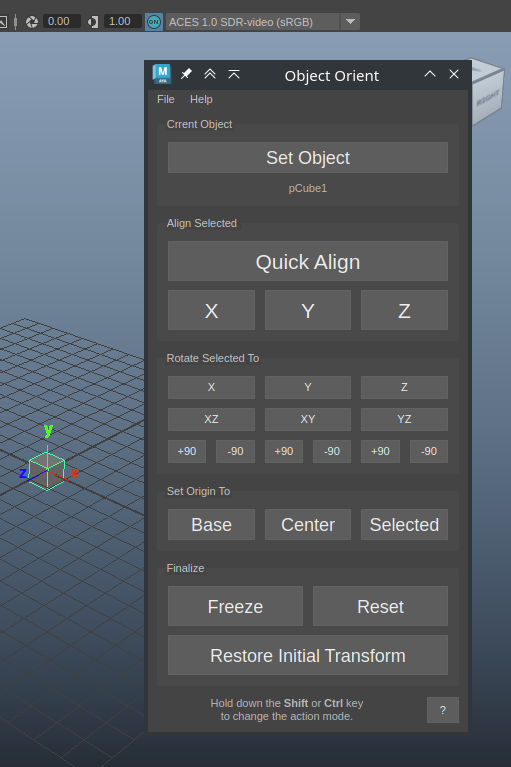
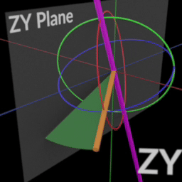
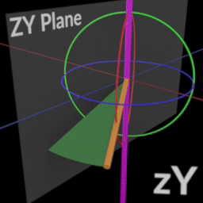
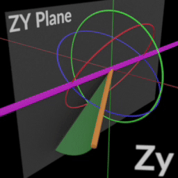

# Maya Restore Orient Tool

Allows you to restore the orientation of an object based on selected reference elements.
This tool is useful when the original object has been transformed in the scene
and the transformations have been frozen. For example, all geometry in the scene has been merged into a single object.
After separating the large object into individual objects, the Orient Tool will help you restore the transformations
of the original objects and move them to the center of the world coordinates.
You can also return the restored object to its original location in the scene, but with the correct transformations.

### Installation

Copy the `pw_restore_object_orient` folder to the Maya scripts directory, for example `~/maya/scripts`

To launch in Maya, add a button with this code

```python
import pw_maya_restore_orient
pw_maya_restore_orient.show()
```

### Usage

1. First, select an object in the scene. This should be a `Transform` node. It doesn't matter if it's a single object or a group. Click the `Set Object` button.
2. Switch to component selection mode and select reference elements.
   When selecting, try to choose elements that are on the axis of symmetry or are symmetrically positioned relative to the central axis.
   When selecting multiple components, it makes sense to choose coplanar components (lie in the same plane).
   A reference vector is created from the selected components, which is then used for alignment and rotation manipulations.
3. Select an operation and click the corresponding button in the dialog.

> The results of alignment operations will differ when the `Shift` and `Ctrl` modifiers are held.

### Reference Element Options

- 1 point
- 2 points
- 3 points
- 1 edge
- 2 edges
- multiple edges (more than 2)
- edge loop
- 1 face
- 1 point + 1 edge
- 1 point + 2 edges
- 2 faces
- multiple faces (more than 2)
- face loop

#### Calculation of the Initial Vector

From any supported combination of selected components, an initial vector or basis for rotation is always calculated.
For example, if 1 polygon is selected, its initial vector is the **normal of that polygon**. If multiple polygons are selected,
the initial vector is the **average normal** of those polygons.
When an edge is selected, the initial vector is directed **along that edge**.
When two points are selected, the vector will be directed **from one point to the other**.

This should be considered when choosing reference components.

### Dialog Controls



#### Current Object

`Set Object` - Select the object you will work with. This can only be a `Transform` node.
If a group is selected, all manipulations will affect all objects in the group.
With the `Ctrl` key held, the current object will be unset.

#### Align Selected

`Quick Align / Preview` - Quickly align the object using the current selection. With the `Shift` key held, the reference vector is inverted.
Quick alignment selects the nearest world axis to the reference vector. Hold **Shift** to invert the alignment direction.
Hold down `Ctrl` to preview the original axes for the selected element.

`X/Y/Z` - Align the object using the current selection, with the selected reference element oriented along the chosen axis.
Hold **Shift** to invert the direction of this axis.

#### Rotate Selected To

A group of buttons for quick rotation and alignment of orientation.

`X/Y/Z` - Orient the object along the selected axis relative to the selected element. The calculated vector will be 
directed exactly along the specified axis.

`XZ/XY/YZ/YX/ZY/ZX` - Rotate the axis of the selected element onto the chosen plane. This is convenient for 
correcting the orientation of the object after the main alignment.

By default, the shortest path is selected. The rotation axis will be perpendicular to the reference 
vector lying on the specified plane.

The `Shift` and `Ctrl` keys modify the rotation axis. The selected axis remains capitalized on the button.

For example, if you select an edge and press the `ZY` button, the object will rotate the selected edge to the `ZY` 
plane around the perpendicular to the reference vector that lies on the plane.



If you hold `Ctrl`, the text will change to `Yz`, and the rotation axis will be the `Y` axis.



If you hold `Shift`, the text on the button will change to `Zy`, meaning the rotation will occur along the `Z` axis.




This allows you to maintain the original orientation along the specified axis.

`+90 / -90` - rotation around the specified axis by the specified angle. When pressing `Shift`, the angle changes to 180; 
with the `Ctrl` key, the angle also changes to 180.

#### Set Origin To

`Base / Drop Down` - Move the object to the center of coordinates along `X` and `Z` and align the lowest point to 0 along the `Y` axis.
Hold `Ctrl` to move only along the `Y` axis down.

`Center` - Move the center of the object to the center of world coordinates.

`Selected` - Find the center of the selected elements and move it to the center of world coordinates.

#### Finalize

`Freeze` - Call the `Modify/Freeze Transformations` command for the current object and all child objects.

`Reset` - Reset the changes to the current object.

`Restore Initial Transform` - Restore the original position of the object in the scene after restoring transformations.
This option is available after the `Freeze` command and before the current object selection is reset.
The object will be moved to its original position but with the correct transformations relative to the new orientation and position.

### API

Example of restoring transformations for multiple objects using the API. 
In this example, scale is not considered, assuming all objects have a scale of 100%.

```python
from pymel.core import *
from pw_maya_restore_orient import tools, orient

face1_index = 3  # index of the first polygon
face1_axis = '-y'  # direction of the reference vector (normal) for the first polygon
face2_index = 2  # index of the second polygon
face2_plane = 'xy'  # plane to which we rotate the reference vector (normal of the second polygon)
face2_rot_axis = 'y'  # rotation axis

for obj in selected():
    print('Restore orient for', obj)
    ornt = orient.ObjOrient(obj)
    select(ornt.object.f[face1_index])
    ornt.orient_to_axis(face1_axis)
    select(ornt.object.f[face2_index])
    ornt.rotate_to_world_plane(*face2_plane, face2_rot_axis)
    d = tools.get_1axis_from_selection()
    # flip 180 if aligned in the wrong direction
    if d.dot(tools.world_axis_list['x']) < 0:
        ornt.rotate_object('y', 180)
    # move to the origin
    ornt.move_to_origin()
    # freeze transformations
    ornt.freeze_transformations()
    # restore to initial position
    ornt.restore_init_transform()
```

### TODO

- Projection onto a plane is not yet designed to work with polygons
- Calculation and restoration of scale
- Interface for aligning multiple identical objects according to one rule