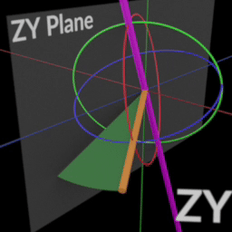
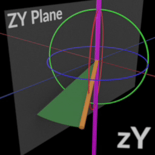

# Maya Restore Orient Tool

Позволяет восстановить ориентацию объекта на основании выбранных опорных элементов.
Этот инструмент полезен в случаях когда исходный объект был трансформирован в сцене 
и трансформации были заморожены. Например, вся геометрия в сцене слита в единый объект.
После разъединения большого объекта в отдельные объекты Orient Tool поможет вам восстановить трансформации
исходных объектов и переместить их в центр мировых координат.
Также можно вернуть восстановленный объект в исходное место в сцене, но уже с правильными трансформациями.

### Установка

Скопируйте папку `pw_restore_object_orient` в директорию со скриптами для Maya. например `~/maya/scripts`

Для запуска в Maya добавьте кнопку с таким кодом

```python
import pw_maya_restore_orient
pw_maya_restore_orient.show()
```

### Использование

1. Для начала выберите в сцене объект. Это должна быть `Transform` нода. Не важно, один объект или группа. Нажмите кнопку `Set Object`
2. Перейдите в режим выделения компонентов и выберите опорные элементы.
При выделении старайтесь выбрать элементы находящиеся на оси симметрии или расположенные симметрично относительно центральной оси. 
При выделении множества компонентов имеет смысл выбирать копланарные компоненты (лежат в одной плоскости).
Из выбранных компонентов создается опорный вектор с которым в дальнейшем проводятся манипуляции выравнивания и поворотов.
3. Выберите операцию и нажмите соответствующую кнопку в диалоге. 

> Результаты операций выравнивания будут отличаться при зажатых модификаторах `Shift` и `Ctrl`.

### Варианты опорных элементов

- 1 point
- 2 points
- 3 points
- 1 edge
- 2 edges
- multiple edges (more than 2)
- edge loop
- 1 face
- 1 point + 1 edge
- 1 point + 2 edges
- 2 faces
- multiple faces (more than 2)
- face loop

#### Расчёт исходного вектора

Из любых поддерживаемых комбинаций выделенных компонентов всегда рассчитывается исходный вектор или базис для поворота.
Например, если выделен 1 полигон то его исходный вектор это **нормаль данного полигона**. Если выделено несколько полигонов,
то исходный вектор это **усреднённая нормаль** этих полигонов.
При выделении ребра исходный вектор направлен **вдоль этого ребра**. 
При выделении двух точке вектор будет направлен **из одной точки в другую**.

Это следует учитывать при выборе опорных компонентов.

### Элементы управления диалога


#### Current Object

`Set Object / Unset` - Выбрать объект с которым будете работать. Это может быть только нода типа `Transform`. 
Если выбрана группа, то все манипуляции будут влиять на все объекты в группе.
С зажатой клавишей `Ctrl` текущий объект будет сброшен.

#### Align Selected 

`Quick Align / Preview` - Быстро выровнять объект используя текущее выделение. С зажатой клавишей `Shift` инвертируется опорный вектор. 
Быстрое выравнивание выбирает ближайшую к опорному вектору мировую ось. Зажмите **Shift**, чтобы инвертировать направление выравнивания. 
Зажмите `Ctrl` чтобы сделать превью исходных осей для выделенного элемента.

`X/Y/Z` - Выровнять объект используя текущее выделение, при этом выделенный опорный элемент будет ориентирован по выбранной оси. 
Зажмите **Shift**, чтобы инвертировать направление этой оси.

#### Rotate Selected To

Группа кнопок для быстрого вращения и выравнивания ориентации.

`X/Y/Z` - Ориентировать объект вдоль выбранной оси относительно выбранного элемента. 
Рассчитанный вектор будет направлен ровно по указанной оси.

`XZ/XY/YZ/YX/ZY/ZX` - Повернуть ось выбранного элемента на выбранную плоскость. Удобно для коррекции ориентации объекта
после основного выравнивания.

По умолчанию выбирается кротчайший путь. Осью поворота будет перпендикуляр к опорному вектору лежащий на указанной плоскости.


Клавиши `Shift` и `Ctrl` изменяют ось поворота. Выбранная ось остается написана на кнопку заглавной буквой.


Например, если выделить ребро и нажать кнопку `ZY` то объект повернётся выбранным ребром к плоскости `ZY` 
вокруг перпендикуляра к опорному вектору который лежит на плоскости.



Если зажать `Ctrl`, то текст изменится на `Zy`, ось вращения будет ось `Y`. 



Если зажать `Shift`, то текст на кнопке изменится на `Zy`, то есть вращение произойдет вдоль оси `Z`.


Это позволить сохранить изначальную ориентацию вдоль указанной оси.

`+90 / -90` - вращение по указанной оси на указанный угол. 
При нажатии `Shift` угол меняется на 180, с клавишей `Ctrl` угол меняется на 180.

#### Set Origin To

`Base / Drop Down` - Переместить объект в центр координат по `X` и `Z` и выровнять самую нижнюю точку в 0 по оси `Y`.
Зажмите `Ctrl` чтобы переместить только по оси `Y` вниз.

`Center` - Переместить центр объекта в центр мировых координат.

`Selected` - Найти центр выделенных элементов и переместить его в центр мировых координат.

#### Finalize 

`Freeze` - вызвать команду `Modify/Freeze Transformations` для текущего объекта и всех дочерних объектов.

`Reset` - сбросить изменения текущего объекта. 

`Restore Initial Transform` - Вернуть исходное положение объекта в сцене после восстановления трансформаций. 
Опция доступна после команды `Freeze` и пока не сброшен выбор текущего объекта. 
Объект переместится в исходное положение, но уже с правильными трансформациями относительно новой ориентации и позиции.

### API

Пример восстановления трансформаций для множества объектов с помощью API.
В данном примере не учитывается масштаб, считается что все объекты имеют масштаб 100%.

```python
from pymel.core import *
from pw_maya_restore_orient import tools, orient

face1_index = 3  # индекс первого полигона
face1_axis = '-y'  # направление опорного вектора (нормали) для первого полигона
face2_index = 2  # индекс второго полигона
face2_plane = 'xy'  # плоскость на которую поворачиваем опорный вектор (нормаль второго полигона)
face2_rot_axis = 'y'  # ось поворота

for obj in selected():
    print('Restore orient for', obj)
    ornt = orient.ObjOrient(obj)
    select(ornt.object.f[face1_index])
    ornt.orient_to_axis(face1_axis)
    select(ornt.object.f[face2_index])
    ornt.rotate_to_world_plane(*face2_plane, face2_rot_axis)
    d = tools.get_1axis_from_selection()
    # разворот на 180 если выравнилось не в правильную сторону
    if d.dot(tools.world_axis_list['x']) < 0:
        ornt.rotate_object('y', 180)
    # перемещаем в центр координат
    ornt.move_to_origin()
    # сохраняем изменения
    ornt.freeze_transformations()
    # возвращаем на исходное положение
    ornt.restore_init_transform()
```

### TODO

- Проекция на плоскость пока не рассчитана на работу с полигонами
- Расчёт и восстановление масштаба
- Интерфейс для выравнивания множества одинаковых объектов по одному правилу